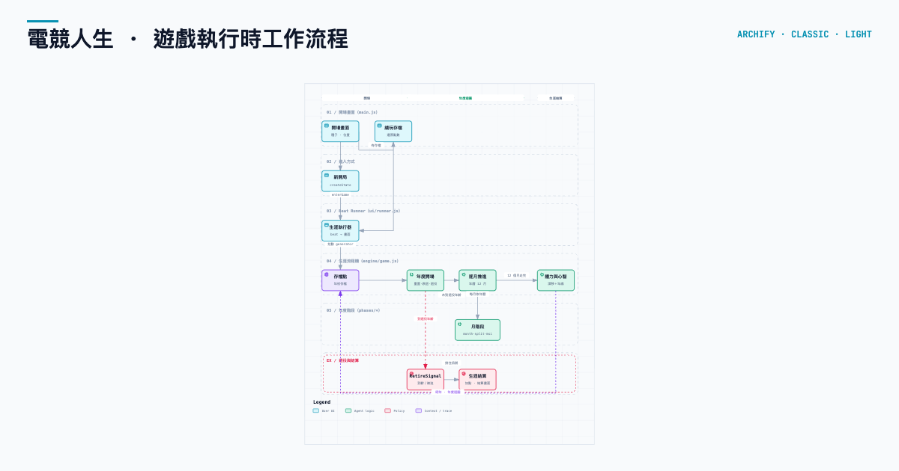

# 電競人生：LoL 職業選手生涯模擬

純文字的 LoL 電競選手生涯養成遊戲。從 2012 年 S2 入行，走過網咖盃賽、試訓、主場賽區（GPL→LMS→PCS→LCP），也能選擇加入海外頂級賽區（LCK／LPL／LEC／LCS），一路打到 MSI 與世界賽。以月為回合管理體力與訓練，賽事期間逐場下決策。

👉 **[點我直接遊玩](https://vik1n9.github.io/esportlife/)**

> 本專案**靈感來自** [YaKyuLife（棒球生涯模擬器）](https://github.com/LeoGGcat/yakyulife)，
> 但不含原作者程式碼，詳見「[授權與出處](#授權與出處)」。



## 遊戲特色

- **中度史實演進**：主場聯賽隨年份演進（GPL→LMS→PCS→LCP），賽段結構逐年（2012 單季→春／夏→2025 三賽段），MSI（2015+，2020 停辦），世界賽賽制（小組賽→入圍賽→2023 起 Swiss），席位數與種子序制度隨年份切換。
- **MSI 與世界賽**：賽制依照過去歷史搭建。賽段冠軍去得了 MSI，世界賽看種子序，最後一張門票要打地區資格賽。
- **月回合制**：一年十二個月，每月選一個行動。賽事月（季後賽／MSI／世界賽）不訓練，照樣有自然恢復與備賽戰術。
- **體力是資源**：0–100，訓練與出賽都會消耗，休息與每月自然恢復會回。低了訓練成功率下滑、受傷風險提高。
- **賽事事件序列**：賽前敘事、備賽戰術、戰術結算、比分、賽後敘事與心理結算。
- **種子只決定天賦**：起始屬性、潛力天花板、性格底色由種子決定。同一個種子可以反覆玩出不同的人生。
- **先發不是必然**：打不到隊伍平均、默契見底、傷癒回歸位子被頂，都會被下放板凳。
- **老將長壽機制**：對照 Faker 型頂級選手可打到 30+；衰退曲線由年齡與特質決定。
- **歷史解散與改寫**：真實在該年解散的隊伍，若玩家在隊且未帶隊奪世界冠，季末強制解散進入自由市場。
- **四階特質合成**：通用 → 稀有 → 史詩 → 傳說，概念取自 LoL 道具合成，越往上疊生涯天花板越高；稀有與史詩素材分屬兩池，可以同時養。
- **兩層養成**：玩家只經營六屬性（體能／靈巧／意識／技巧／默契／決斷，0–100，越接近潛力天花板成本越高）；十二項技能由屬性加權導出、不能直接加點，位置身分決定哪些技能吃重。
- **十二技能**：對線／操作／視野／節奏／支援／資源控制／會戰／開團／保護／邊線／轉線／走位。
- **隱藏心理六維**：抗壓／自信／動機／紀律／信任／韌性，不可見，只影響發揮穩定度與失誤率。
- **五路養成**：上路／打野／中路／射手／輔助，搭配 8 隻真實英雄池、版本 Meta 與位置身分權重。
- **英雄池會成長**：出賽累積專精，池越深越吃得住版本大改動。
- **人生隨機事件**：手腕傷病、宵夜誘惑、單身誘惑、媒體專訪、代言、隊內矛盾、海外集訓、通宵練功、梗圖爆紅、開台首播、賽前互嗆、極限搶龍、被釣魚等，取材自 LoL 社群與實況圈梗。
- **細緻數據**：K/D/A、CS、視野、傷害占比、單殺、MVP，逐季累積結算。
- **隨時查閱選手資料**：六屬性與潛力刻度、位置技能、英雄專精、版本落差、隊友與教練、合約狀態、體力與已覺醒素質。
- **存檔續玩**：每年年初自動存檔，關掉分頁也接得回來。

## 遊玩方式

- 開局選擇 ID 與位置，可輸入自訂種子碼（同種子＝同天賦，但人生每次都不一樣）。
- 每月在全力訓練／減量訓練／休息／復健預防之間選一個行動。訓練會擲骰加點六屬性（成長成本隨潛力遞增），休息大幅回體、復健小幅回體並降低受傷風險。
- 例行賽跟著月份出戰報，體力在同一個月扣。
- 季後賽／MSI／世界賽的每個系列賽，賽前在四項備賽戰術中選一項。
- 右上角 ☰ 隨時打開選手資料面板；↺ 重新開始。

## 授權與出處

本專案靈感來自 [YaKyuLife（棒球生涯模擬器）](https://github.com/LeoGGcat/yakyulife)，由 [LeoGGcat](https://github.com/LeoGGcat) 開發。最初的引擎骨架、事件卡與隱藏特質概念承袭自原版；該等承袭程式碼已在 S03–S05 全部淨室重寫完畢（血緣表見 `ARCHITECTURE.md`，重寫記錄見 `docs/v4/` 的 S02–S06），現今專案不含原作者程式碼。賽制、角色、數據與介面皆為 LoL 電競內容的原創改寫。

- 靈感來源：[LeoGGcat / yakyulife](https://github.com/LeoGGcat/yakyulife)
- 開發者：Vik1n9（esportlife）
- 授權：[CC BY-NC-SA 4.0](https://creativecommons.org/licenses/by-nc-sa/4.0/)（見 `LICENSE`）

### 授權說明

本專案以 **Creative Commons 姓名標示—非商業性—相同方式分享 4.0 國際版（CC BY-NC-SA 4.0）** 授權釋出。三個條件分別是：

- **姓名標示（BY）**：使用或改作本專案時，必須註明原作者（Vik1n9／esportlife）與出處，並標示是否修改過。
- **非商業性（NC）**：禁止以本專案或其衍生作品牟利。不得販售、接廣告、做商業代管或任何以商業優勢或金錢報酬為主要目的的利用。玩家之間免費分享、個人遊玩與學習改作都屬於允許範圍。
- **相同方式分享（SA）**：若改作或衍生本專案，衍生作品必須以相同授權（或 CC 認可的相容授權）釋出，不得換成更嚴格的條款。

過去曾以 MIT 授權釋出，於 2026 年改為本授權，兩者互不相容（MIT 允許商用），故以 `LICENSE` 內的現行條款為準。本專案本身為非營利粉絲致敬作品，此授權與 Riot Games 政策並無關聯，Riot 相關名詞的使用規範仍見下方「介面與素材」。

### 介面與素材

- 介面視覺語彙對齊 tftactics.gg：深藍色階、藍色動作、金色狀態、terracotta 階段底線，長文可讀性優先。
- 字型使用 OFL 授權的 Inter / Noto Sans TC（由 Google Fonts 載入，離線時自動回退系統字型）。
- 本專案為非營利粉絲致敬作品，依 Riot Games「Legal Jibber Jabber」政策使用相關名詞；未使用任何 Riot 旗下圖片、圖示或商標。Riot Games 並未背書或贊助本專案。詳細規範見 <https://www.riotgames.com/en/legal>。

依 Riot Games 政策規定，附英文聲明（English notice, as required by Riot Games' policies）：

> ESPORTLIFE was created under Riot Games' "Legal Jibber Jabber" policy using assets owned by Riot Games. Riot Games does not endorse or sponsor this project.
>
> ESPORTLIFE isn't endorsed by Riot Games and doesn't reflect the views or opinions of Riot Games or anyone officially involved in producing or managing Riot Games properties. Riot Games, and all associated properties are trademarks or registered trademarks of Riot Games, Inc.

## 本機開發

零建置、零相依。但 ES modules 需要 HTTP 協定（直接開 `file://` 會被 CORS 擋），所以請起一個靜態伺服器：

```bash
python3 -m http.server 8080
```

然後開 <http://localhost:8080>。

跑回歸測試（需要 Node 18+，不需要 `npm install`）：

```bash
npm test                   # 或 node tests/run.mjs
node tests/run.mjs kernel  # 只跑某一區（kernel／phases／history／regression）
```

引擎完全不依賴 DOM，所以這套測試會在 Node 裡實際跑完 160 段生涯，並驗證種子界線、生涯評價分布、特質合成、版本落差方向、史實賽制、體力經濟與解散名單過濾。目前 18758 項檢查全綠。

## 文件

- 架構說明：`ARCHITECTURE.md`
- 完整設計規格：`ESPORT-DESIGN-V4.md`（v4.4，v4.1～v4.4 增訂已併入，含增訂註釋與決策紀錄）
- 攻略：`WIKI.md`
- 更新記錄：`CHANGELOG.md`
- 開發日誌：`WORKLOG.md`
- v4 現況快照（現在站在哪裡、安全網守得住什麼）：`docs/v4/00b-穩定點快照.md`
- v4 重建工作說明書（45 站分四組，進行中）：`docs/v4/README.md`
- v4 賽制設計稿：`docs/superpowers/specs/2026-08-11-lol-competition-format-design.md`
- v2 時期的改造計劃書（存查）：`docs/archive/改造計劃書-v2.1.md`

## 目前施工進度

V4 重建共 45 站（基礎 31 站＋庚組 NPC 選手與戰隊 8 站＋辛組賽事模擬 6 站），已完成 29 站——甲～戊全數收斂，全部可遊玩內容已上線。己組 S21 DEMO 組裝未開始（組裝前架構審查已過，三層退役事件／獨有特質／WORLDS_ORDER 空格／事件卡 0 條件四條交接鏈斷點已列出）；庚辛兩組定案已併入規格，施工待前組收斂。詳細狀態表見 `docs/v4/README.md`。

| 階段 | 狀態 |
| --- | --- |
| 甲 · 清理與地基（S01–S06） | ✅ 完成 |
| 乙 · 護欄與規格（S07–S08b） | ✅ 完成 |
| 丙 · 核心層（S09–S13） | ✅ 完成（屬性 0–100／十二技能／教練評價／六維心理／體力系統） |
| 丁 · 回合與訓練（S14–S16） | ✅ 完成（月回合制／賽事事件序列／生命週期曲線／設施制訓練） |
| 戊 · 內容（S17–S21a） | ✅ 完成（觸發引擎／生涯任務／編輯器／事件卡 86＋任務卡 25＋訓練卡 60／傳說 20／配方重製／生涯傳記） |
| 己 · 組裝（S21–S22） | ⏳ 未開始（DEMO 組裝／文件同步，S21 組裝前審查已過） |
| 庚 · NPC 選手與戰隊（S23–S30） | ⏳ 定案已併（v4.3.3 §23，施工未開始） |
| 辛 · 賽事模擬與戰績參照（S31–S36） | ⏳ 定案已併（v4.4 §24，施工未開始） |

> 規格書已升到 v4.4（v4.3：生命週期曲線、訓練事件卡、特質重建、市場淘汰；v4.3.1：編輯器整合、四池管理、訓練邊界廢除；v4.3.3：庚組 NPC 選手與戰隊 §23；v4.4：辛組賽事模擬與戰績參照 §24）。戊組全數收斂：S18 事件卡 86＋生涯任務卡 25＋訓練卡 60 分批做完、S19b 傳說特質擴到 20、S19c 配方重製（FUSIONS 重寫、死卡全救活）、S21a 生涯傳記上線。庚辛兩組細部規格（NPC schema、百分位母體、模擬引擎）由 S23／S31 站定案後回寫。`npm test` 18758 項全綠，SAVE_VERSION 19。說「動工」即由 `docs/v4/next-station.mjs` 抓下一站續做。